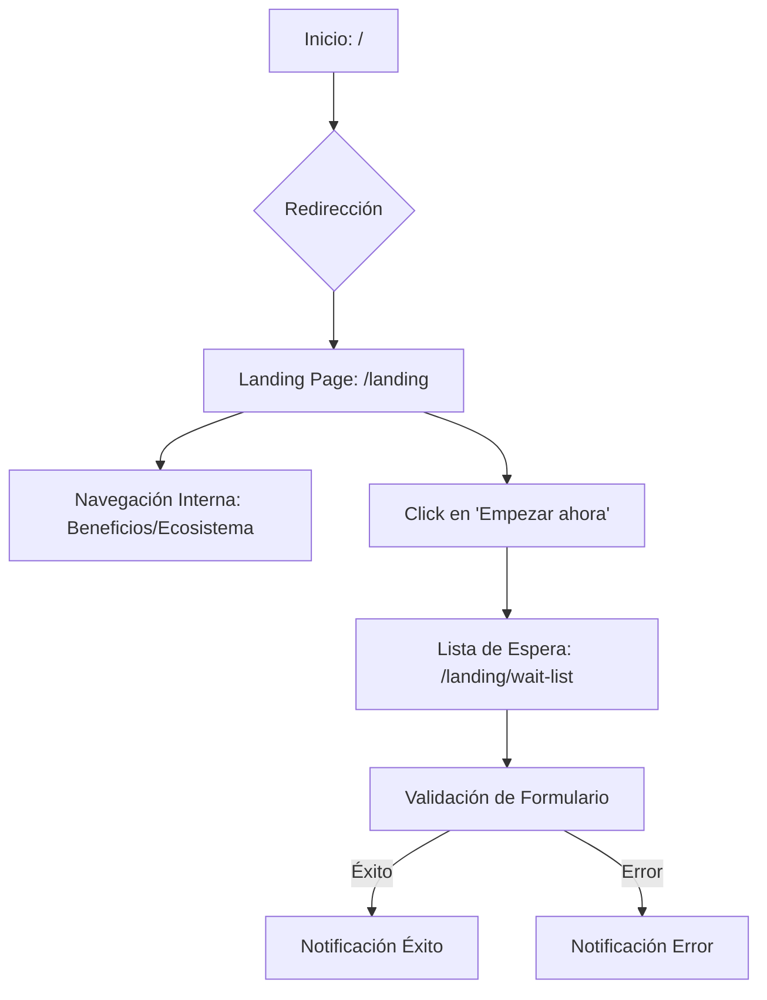

# Documentación del Proyecto: Optihome

Este documento detalla la planificación, diseño y desarrollo de **Optihome**, un proyecto académico de automatización del hogar (domótica) enfocado en la privacidad y el control local.

---

## 1. Introducción

### Nombre del Proyecto

**Optihome: Domótica Privada y Local.**

### Contexto Académico

Este proyecto se ha desarrollado como parte de un proyecto final para los estudios de [Grado Superior en Desarrollo de Aplicaciones Web (DAW) / Multiplataforma (DAM) / SMR], con el objetivo de demostrar competencias en el uso de frameworks modernos de frontend (Angular 21), arquitectura de componentes (Atomic Design) y gestión de estado reactiva (Signals).

### Objetivo

El objetivo principal de Optihome es ofrecer una plataforma web informativa y de captación para una solución de domótica que no dependa de la nube (Cloud-free). Se busca concienciar sobre la privacidad de datos y ofrecer una alternativa local a las soluciones comerciales actuales.

### Alcance y Limitaciones

- **Alcance:** Landing page informativa, sección de beneficios, catálogo visual de productos del ecosistema, guía de configuración simplificada y sistema de lista de espera con validación.
- **Limitaciones:** Al ser un proyecto frontend-only, no existe persistencia de datos real en servidor ni control directo de hardware IoT. Las notificaciones y registros de usuarios se gestionan de forma volátil en la sesión del cliente.

### Público Objetivo

Entusiastas de la tecnología, defensores de la privacidad y propietarios de viviendas que buscan modernizar su hogar sin comprometer sus datos personales ante terceros.

---

## 2. Análisis del Problema

### El Problema

La mayoría de los dispositivos inteligentes actuales requieren una conexión constante a internet y el envío de datos a servidores externos (nube) para funcionar. Esto genera:

1.  **Vulnerabilidad de privacidad:** Los hábitos de los usuarios son recolectados.
2.  **Dependencia de terceros:** Si el servidor de la empresa cae o el servicio se descontinúa, el hogar deja de ser "inteligente".
3.  **Latencia:** El envío de comandos a la nube y de vuelta al hogar ralentiza la respuesta.

### Requisitos Funcionales

- **RF1:** Presentación clara de la propuesta de valor (Privacidad, Velocidad, Local).
- **RF2:** Visualización de componentes del ecosistema inteligente.
- **RF3:** Formulario de suscripción a la lista de espera con validación de email.
- **RF4:** Sistema de notificaciones en tiempo real para feedback del usuario.
- **RF5:** Navegación fluida entre la página principal y la sección de registro.

### Requisitos No Funcionales

- **RNF1 (Rendimiento):** Carga rápida de imágenes y componentes.
- **RNF2 (Responsividad):** Interfaz adaptada a dispositivos móviles, tablets y escritorio.
- **RNF3 (Accesibilidad):** Cumplimiento de estándares WCAG AA para navegación y contraste.
- **RNF4 (Arquitectura):** Código modular y mantenible siguiendo Atomic Design.

### Casos de Uso Principales

1.  **Exploración de beneficios:** El usuario navega para entender por qué la domótica local es mejor.
2.  **Consulta de ecosistema:** El usuario visualiza los productos disponibles (hubs, sensores, interruptores).
3.  **Registro en lista de espera:** El usuario introduce su email para recibir actualizaciones del lanzamiento.

---

## 3. Diseño del Sistema

### Estructura de Navegación

```markdown
[Home / Landing]
├── Sección: Hero (Propuesta de valor)
├── Sección: Beneficios (¿Por qué local?)
├── Sección: Ecosistema (Productos)
├── Sección: Guía (Cómo funciona)
└── Sección: Registro (Lista de espera)
```

### Aplicación de Atomic Design

El proyecto sigue una jerarquía estricta para asegurar la reutilización:

- **Atoms:** Elementos base como títulos (H2, H3), párrafos de texto e iconos.
- **Molecules:** Combinaciones de átomos, como tarjetas de producto (`product-card`), tarjetas de beneficio (`card`) o cabeceras de sección.
- **Organisms:** Secciones completas de la página como el `header`, `footer`, la sección de ecosistema o el sistema de `notifications`.
- **Templates:** Estructuras de layout (ej. `landing-layout`) que definen dónde se colocan los organismos.
- **Pages:** Instancias concretas con datos reales que se sirven mediante rutas (ej. `landing-page`, `waitlist`).

### Diagrama de Flujo de Navegación



---

## 4. Arquitectura

### Stack Tecnológico

- **Framework:** Angular 21.
- **Lenguaje:** TypeScript (Strict Mode).
- **Gestión de Estado:** Angular Signals.
- **Estilos:** CSS3 con variables nativas.
- **Iconografía:** Lucide Angular.
- **Control de Versiones:** Git.

### Justificación Técnica

- **Angular 21:** Se elige por su robustez en aplicaciones empresariales y las nuevas funcionalidades de Signals que simplifican la reactividad.
- **Frontend-only:** Para centrar el proyecto académico en la experiencia de usuario y arquitectura de componentes sin distracciones de infraestructura de servidor. Se aprovecha la capacidad de **SSR (Server-Side Rendering)** y **SSG (Static Site Generation)** de Angular 21 para mejorar el SEO y el rendimiento de carga.
- **Atomic Design:** Facilita la escalabilidad; si el proyecto crece, los componentes ya están aislados y son testables.
- **Despliegue en Vercel:** Elegido por su integración nativa con el ecosistema de Angular, permitiendo una automatización completa del flujo de CI/CD y una gestión eficiente de las capacidades de renderizado en el servidor.

### Estructura de Carpetas

```text
src/app/
├── components/          # Implementación de Atomic Design
│   ├── landing/         # Componentes específicos de la landing
│   ├── root/            # Componentes globales (Notificaciones)
│   ├── share/           # Componentes reutilizables (Botones, Iconos)
├── config/              # Tipos, Interfaces y Enums globales
├── data/                # Datos estáticos (Mocks de productos/beneficios)
├── services/            # Lógica de negocio y estado (Notificaciones)
├── app.routes.ts        # Definición de rutas
└── app.ts               # Componente raíz
```

---

## 5. Implementación

### Componentes Clave

- **NotificationService:** Servicio inyectable que gestiona una cola de notificaciones mediante `signals`. Utiliza un `effect` para limpiar automáticamente las notificaciones después de 5 segundos.
- **Waitlist Component:** Utiliza los nuevos `form signals` de Angular para una validación reactiva y eficiente del email del usuario.
- **LandingPage:** Componente orquestador que consume datos de `src/app/data` para renderizar dinámicamente las secciones.

### Flujo de Datos

El estado fluye hacia abajo mediante `input()` y los eventos fluyen hacia arriba mediante `output()` o acciones pasadas por referencia (signals). Las notificaciones son transversales y se disparan desde cualquier componente llamando al `NotificationService`.

---

## 6. Pruebas

### Pruebas Funcionales Realizadas

1.  **Navegación:** Verificación de que los enlaces y botones de acción redirigen a las rutas correctas (`/landing`, `/landing/wait-list`).
2.  **Validación de Formulario:**
    - Entrada vacía: Muestra error "Es necesario introducir un email".
    - Formato incorrecto: Muestra error de validación de formato.
    - Formato correcto: Muestra notificación de éxito y actualiza el contador (local).
3.  **Responsive Design:** Comprobación de visualización correcta en iPhone 12 Pro (Mobile), iPad Air (Tablet) y Desktop (1440p).
4.  **Sistema de Notificaciones:** Verificación de que las notificaciones aparecen, se apilan y desaparecen tras el tiempo programado.

### Errores Detectados y Soluciones

- _Error:_ La línea de tiempo en "Así de simple" no se alineaba en dispositivos móviles.
- _Solución:_ Se ajustó el grid layout para pasar de una vista de dos columnas a una de una sola columna con numeración lateral en pantallas pequeñas.

---

## 7. Seguridad

### Consideraciones Frontend

Aunque no hay backend, se han aplicado buenas prácticas:

- **Sanitización de entradas:** Angular protege automáticamente contra ataques XSS al renderizar contenido.
- **Validación estricta:** La lógica de formularios impide envíos de datos malformados.

### Riesgos en Producción (Escenario Real)

Si se añadiera un backend, sería crítico implementar:

1.  **Autenticación JWT:** Para proteger el acceso a paneles de administración.
2.  **Rate Limiting:** En el endpoint de la lista de espera para evitar spam de registros.
3.  **Cifrado TLS/SSL:** Obligatorio para proteger el email del usuario en tránsito.

---

## 8. Despliegue

### Requisitos

- Node.js v18 o superior.
- Gestor de paquetes `pnpm` (recomendado).

### Instrucciones de Instalación

1.  Clonar el repositorio.
2.  Ejecutar `pnpm install` para instalar dependencias.

### Ejecución y Build

- **Desarrollo:** `pnpm start` (abre `http://localhost:4200`).
- **Producción:** `pnpm build` (genera los archivos en `/dist/optihome`).

### Plataforma de Despliegue

El proyecto se encuentra desplegado en **Vercel**. Esta decisión se justifica por:

1.  **Integración Nativa con Angular:** Vercel detecta automáticamente el framework y optimiza el build.
2.  **Soporte SSR/SSG:** Facilita la implementación de Server-Side Rendering y Static Site Generation, cruciales para el rendimiento y SEO en una landing page.
3.  **CI/CD Automático:** Cada commit en la rama principal desencadena un despliegue automático, asegurando que la versión en producción esté siempre actualizada.
4.  **Simplicidad:** Elimina la necesidad de configurar servidores manuales, permitiendo centrarse exclusivamente en el desarrollo del producto.

---

## 9. Mejoras Futuras

1.  **Integración con Backend:** Crear una API con NestJS o Node.js para persistir los registros en una base de datos PostgreSQL.
2.  **Panel de Administración:** Una sección protegida para visualizar métricas de la lista de espera.
3.  **Simulador de Dispositivos:** Una herramienta interactiva donde el usuario pueda "encender/apagar" dispositivos virtuales para ver la respuesta local instantánea.
4.  **Internacionalización (i18n):** Soporte para múltiples idiomas para alcanzar un público global.

---

_Documentación generada para el proyecto Optihome - 2026_
